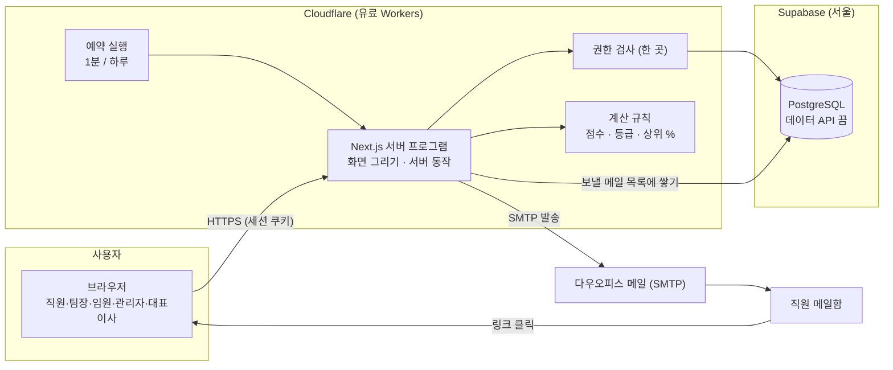
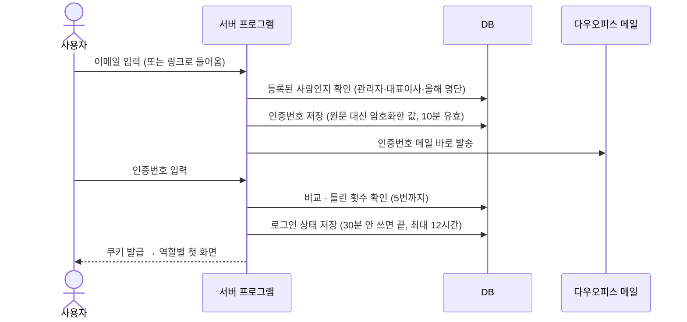
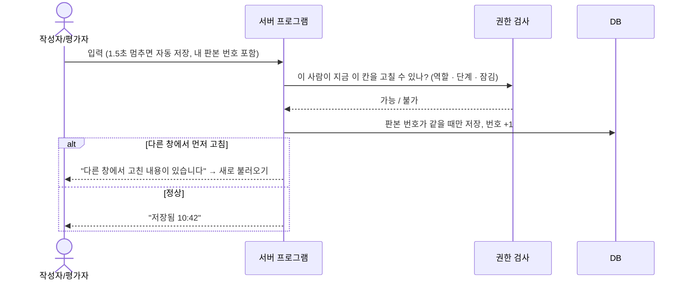
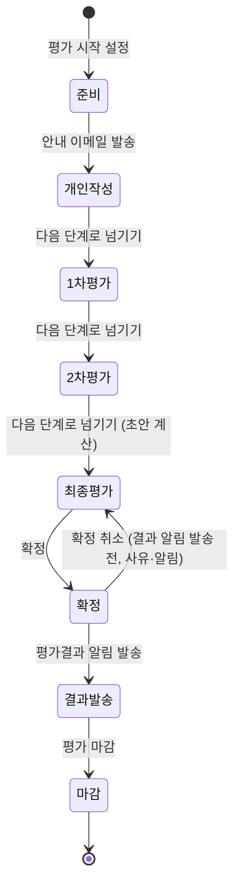
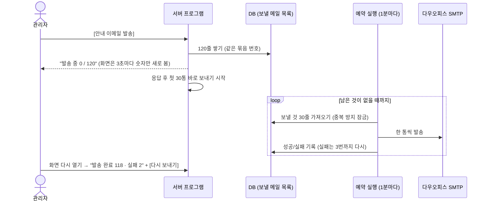

# 1. 아키텍처

> 결정 근거는 `adr/` 폴더. 용어는 `docs/domain/02-공통-용어집.md`를 따른다.

## 1-1. 한 문단 요약

화면과 서버는 **Next.js 프로그램 하나**다. 이 프로그램은 **Cloudflare Workers**(유료, 월 5달러)에서 돌아간다. 사용자의 브라우저는 이 프로그램하고만 이야기한다. 프로그램은 **Supabase의 PostgreSQL**(서울)에 직접 연결해 데이터를 읽고 쓴다. 메일은 **다우오피스 메일 계정(SMTP)** 으로 보낸다. **누가 무엇을 볼 수 있는지는 프로그램 안의 권한 검사 한 곳**에서 정한다. DB의 바깥 출입문(Supabase 데이터 API)은 꺼 둔다. 1분마다 Cloudflare 예약 실행(Cron)이 "보낼 메일 목록"을 비우고, 하루 한 번 점검 일을 한다. 나중에 회사 서버로 옮길 때는 **같은 프로그램을 Node.js로 실행**하고 DB 주소만 바꾼다.

## 1-2. 무엇이 어디서 돌아가는가

| 부분 | 어디서 | 하는 일 |
|---|---|---|
| 화면 | 사용자 브라우저 (서버가 그려서 보냄) | 보여 주기, 입력 받기, 임시저장 요청, 발송 진행 숫자 새로 보기 |
| 서버 프로그램 (Next.js) | Cloudflare Workers (나중에 회사 서버 Node.js) | 이메일 인증, 권한 검사, 평가지 저장, 단계 넘기기, 엑셀 읽기·만들기, 점수·등급 계산, 메일 목록 쌓기 |
| 예약 실행 | Cloudflare Cron Triggers (나중에 회사 서버 cron) | 1분마다: 보낼 메일 내보내기 / 하루 한 번: DB 깨우기, 오류 요약 메일, 보관 기간 점검 |
| 데이터 | Supabase PostgreSQL, 서울 (나중에 회사 PostgreSQL) | 모든 기록 |
| 메일 | 다우오피스 메일 서버 (SMTP) | 인증번호, 안내, 독촉, 결과 알림, 관리자 알림 |

**외부로 나가는 것은 DB와 메일 두 곳뿐이다.** AI나 파일 저장소 같은 다른 외부 서비스는 쓰지 않는다.

## 1-3. 전체 그림

## 1-4. 주요 흐름

### ① 이메일 인증 (모든 사람)

- 등록되지 않은 이메일에도 "보냈습니다"라고 똑같이 답한다. 누가 명단에 있는지 바깥에서 알아낼 수 없게 하기 위해서다.
- 인증번호 메일만 목록에 쌓지 않고 바로 보낸다. 기다리게 하면 안 되기 때문이다.

### ② 평가지 쓰기와 임시저장 (직원·팀장·임원)

### ③ 다음 단계로 넘기기 (관리자)

관리자가 [다음 단계로 넘기기]를 누르면 다음 순서로 진행된다.
1. 미제출자 명단을 확인한다.
2. **정기평가의 단계 값 하나만** 바꾼다.
3. 잠김은 따로 저장하지 않는다. **"지금 단계"를 보고 매번 판단**한다. 그래서 일부만 잠기는 어긋남이 생기지 않는다.
4. 다음 단계 평가자에게 안내 메일을 목록에 쌓는다.

- **가점 입력**은 단계와 별개로 **확정 전까지** 열려 있다. 확정 취소를 해도 다시 열리지 않는다.

### ④ 메일 120통 보내기 (안내·독촉·결과 알림)

### ⑤ 엑셀 올리기 (직원 명단·가점)

1. 브라우저가 파일을 보낸다. 1MB 이하, .xlsx만 받는다.
2. 서버가 바로 읽어 **미리보기 결과만** 돌려준다. 파일은 저장하지 않는다.
3. 관리자가 [반영하기]를 누르면 같은 파일 내용을 다시 검사한 뒤 줄 단위로 저장한다.

### ⑥ 등급 계산과 등급조정

- 2차평가를 넘기는 순간 **최종점수와 그룹별 초안 등급**을 계산해 저장한다.
- 등급조정 미리보기("이렇게 바뀝니다")는 서버가 계산만 하고 저장하지 않는다. [적용]을 눌러야 저장하고 이력을 남긴다.
- 대표이사 화면은 같은 저장값을 읽는다. 열 때마다, 그리고 열려 있는 동안 10초마다 새로 읽어서 "실시간 반영"으로 보인다.

### ⑦ 평가결과 알림과 "내 평가결과" 화면

1. 관리자가 [평가결과 알림 발송]을 누르면 메일 목록에 **링크만 담긴 메일**을 쌓는다.
2. 직원이 링크를 누르고 이메일 인증을 하면 **내 평가결과** 화면이 열린다. 1차 점수, 2차 점수, 가점, 최종점수, 평가등급, 상위 %를 보여 준다.
3. 열람 시각을 작업 기록에 남긴다.

## 1-5. 회사 서버로 옮길 때 (나중)

| 지금 | 회사 서버 | 바꾸는 것 |
|---|---|---|
| Cloudflare Workers | Node.js (Docker 1개) | 빌드 방식 하나 (`platform/` 폴더의 실행 환경 어댑터) |
| Cloudflare Cron | 서버 cron 또는 같은 프로그램 내부 타이머 | 같은 주소를 같은 비밀값으로 호출 |
| Supabase PostgreSQL | 회사 PostgreSQL 16 | DB 주소 한 줄 + `pg_dump`/`pg_restore`로 데이터 옮기기 |
| 다우오피스 SMTP | 그대로 | 없음 |

**옮기기 쉽게 지금 지키는 약속**은 세 가지다. 자세한 내용은 `03-규칙.md`에 있다.
- Supabase 전용 기능을 쓰지 않는다. 로그인, 파일 저장소, 데이터 API, 실시간, Edge Functions, RLS가 모두 해당한다.
- Cloudflare 전용 코드는 `platform/` 폴더 안에만 둔다.
- DB 구조는 마이그레이션 SQL 파일로만 바꾼다.

## 1-6. 유저스토리별 구현 방식

| 유저스토리 | 구현 |
|---|---|
| US-01 대상자 확정 | 직원 명단 엑셀 → 서버에서 읽기·검사(6월 30일 이후 입사 제외, 직급→그룹, 팀장 여부→평가지 종류) → `cycle_people` 저장 |
| US-02 평가자 지정 | 명단의 부서·팀장 여부·"담당 임원" 칸으로 1차·2차 평가자를 자동으로 채우고, 화면에서 고치면 `cycle_people.first_reviewer_id` / `second_reviewer_id` 갱신 |
| US-03 일정·안내 | `review_cycles`의 기간 칸 저장 → 안내 메일을 목록에 120줄 쌓기 |
| US-04 평가지 작성 | `evaluations`(업적 글) + `evaluation_scores`(rater=self). 자동 저장 + 판본 번호 |
| US-05 1차 평가 | `evaluation_scores`(rater=first). 권한 검사가 2차 점수를 꺼내 주지 않음 |
| US-06 2차·팀장 평가 | `evaluation_scores`(rater=second, 팀장 평가지는 rater=first를 임원이 입력). 2차평가 단계일 때만 쓰기 허용 |
| US-07 제출 현황판 | 단계별 제출 시각으로 미제출자 목록 계산 (따로 저장하지 않음) |
| US-08 독촉 | 고른 사람에게 독촉 메일을 목록에 쌓기 |
| US-09 가점 | 가점 엑셀 → 미리보기 → `bonus_points` 항목별 저장. 확정되면 쓰기 불가 |
| US-10 점수 계산 | 계산 규칙 모듈의 순수 계산 → `final_results` 저장 |
| US-11 등급 초안 | 그룹별 순위·반올림 인원·근속 동점 규칙 → `final_results.draft_grade` |
| US-12 대표이사 열람 | 대표이사 역할은 `final_results` 일부 칸만 읽기 |
| US-13 등급조정 | 미리보기 계산 → [적용] 때 `final_results.final_grade` 갱신 + `grade_adjustments` 이력 |
| US-14 확정 | `review_cycles.status = confirmed`. 확정 취소는 이력과 다른 관리자 알림 메일 |
| US-15 엑셀 내려받기 | 서버에서 엑셀을 만들어 바로 내려받기 (저장 안 함) |
| US-16 결과 알림 | 링크 메일 → **내 평가결과** 화면 (열람 기록) |
| US-17 관리자 설정 | `app_users`(role=admin) 추가·해제. 마지막 1명은 해제 불가 |
