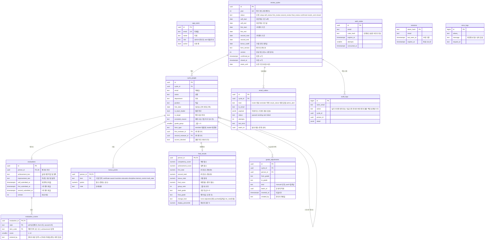

> 2026-10-02 구현 중 보완: 통보용 상위 %는 "등급 좋은 순 → 같은 등급 안 점수 순"으로 세운 자리 ÷ 그룹 인원. 하향 조정된 사람은 새 등급 맨 위, 상향 조정된 사람은 맨 아래에 선다. 보통은 '경계 득점자의 값'과 같고, 조정된 사람이 그 등급에 혼자일 때도 등급과 %가 어긋나지 않는다.
# 2. 데이터 구조

> PostgreSQL 표준 기능만 쓴다 (나중에 회사 DB로 옮기기 위해). 테이블·칸 이름은 영어, 옆에 용어집의 말을 적는다.
> DB가 필요한 시점: **처음부터 필요하다.** 첫 화면인 이메일 인증부터 "등록된 사람인지", "인증번호가 맞는지"를 저장된 값과 비교해야 하기 때문이다.

## 2-1. 관계 그림 (ERD)

모든 테이블에 `created_at`, `updated_at`이 있다. 그림에서는 생략했다.

## 2-2. 테이블과 도메인의 대응

| 테이블 | 용어집의 말 | 메모 |
|---|---|---|
| `app_users` | 관리자, 대표이사 | 해마다 바뀌지 않는 계정. 관리자는 최소 1명이 남아야 한다 |
| `review_cycles` | 정기평가 (연 1회), 개인작성 기간·1차평가 기간·2차평가 기간, 가점 인정 기준일, 확정, 평가 마감 | 1년에 한 줄. **단계(status)가 잠김의 유일한 근거** |
| `cycle_people` | 직원 명단 템플릿 한 줄 = 평가 대상 + 평가자(임원 포함) | 해마다 새로 올리므로 연도별로 따로 둔다. 임원은 평가 대상이 아니어도 평가자라서 명단에 넣는다(`is_target=false`) |
| `evaluations` | 평가지 (팀원용·팀장용 인사평가지) | 업적 기술 두 칸과 단계별 제출 시각 |
| `evaluation_scores` | 본인평가, 1차 평가, 2차 평가, 역량 평가, 업적 평가 | 역량 항목 목록(책임감 등 10개)은 **코드의 양식 정의**에 둔다. 항목이 바뀌면 `form_version`을 올린다 |
| `bonus_points` | 가점 (자격증·포상·직무발명보상·교육참여도·징계사항·내부회계관리제도·다면평가) | 다면평가는 팀장만 입력 가능 |
| `final_results` | 최종평가, 평가 점수, 그룹별 상대평가, 초안 등급, 평가등급, 상위 % | 2차평가를 넘길 때 계산해 저장한다. 최종점수는 등급조정으로 바뀌지 않는다 |
| `grade_adjustments` | 등급조정, 조정, 밀려남 | 되돌리기를 위해 지우지 않고 `reverted_at`으로 표시한다 |
| `email_outbox` | 안내 이메일, 독촉 이메일, 평가결과 알림 | **점수를 담지 않는다.** 보낸 지 30일이 지나면 받는 사람·내용을 지운다 |
| `auth_codes`, `sessions` | 이메일 인증 | 하루 지난 줄은 매일 정리한다 |
| `audit_logs` | (작업 기록) | 누가 넘기고, 확정하고, 조정하고, 결과를 열람했는지 |
| `error_logs` | (오류 기록) | 하루 한 번 관리자에게 요약 메일을 보낸다 |

**저장하지 않는 것**
- 올린 엑셀 원본
- 미제출자 목록 (제출 시각으로 매번 계산)
- 잠김 여부 (단계로 매번 판단)
- 내려받는 엑셀 파일

## 2-3. 누가 어느 줄을 볼 수 있는가

권한 검사 한 곳(`server/authz`)이 이 표대로 동작한다. 각 칸의 기호는 다음과 같다.
- **읽기** / **쓰기**: 그 데이터를 볼 수 있음 / 고칠 수 있음
- **(단계)**: 해당 단계에서만 가능
- **✕**: 볼 수 없음

| 데이터 | 피평가자 본인 | 1차 평가자 (팀장) | 2차 평가자 (임원) | 관리자 | 대표이사 |
|---|---|---|---|---|---|
| 내 평가지 업적 글·본인평가 | 읽기 / 쓰기(개인작성) | 자기 팀원 것 읽기(제출 후) | 맡은 사람 것 읽기(제출 후) | 전부 읽기 | ✕ |
| 1차 점수 | ✕ (결과 알림 뒤 합계만) | 자기 팀원 것 읽기 / 쓰기(1차평가) | 맡은 사람 것 읽기 | 전부 읽기 | ✕ |
| 2차 점수 | ✕ (결과 알림 뒤 합계만) | **✕ (언제나)** | 맡은 사람 것 읽기 / 쓰기(2차평가) | 전부 읽기 | ✕ |
| 팀장 평가지 점수 (임원이 매기는 1차) | ✕ (결과 알림 뒤 합계만) | — | 맡은 팀장 것 읽기 / 쓰기(2차평가) | 전부 읽기 | ✕ |
| 가점 | ✕ (결과 알림 뒤 합계만) | ✕ | ✕ | 전부 읽기 / 쓰기(확정 전) | ✕ |
| 최종평가 (점수·순위·초안·조정) | ✕ | ✕ | ✕ | 전부 읽기 / 쓰기(최종평가 단계) | 이름·부서·직급·최종점수·등급·조정 표시만 읽기 (최종평가 단계부터) |
| 내 평가결과 (1차·2차·가점·최종점수·등급·상위 %) | 결과 알림 발송 뒤 읽기 | ✕ | ✕ | 전부 읽기 | ✕ |
| 등급조정 여부 | **✕ (언제나)** | ✕ | ✕ | 읽기 | 읽기 |
| 명단·관리자·메일 목록·작업 기록 | ✕ | ✕ | ✕ | 읽기 / 쓰기 | ✕ |
| 빈 평가자 점수 대신 입력 | ✕ | ✕ | ✕ | 빈 칸만 쓰기(최종평가 단계, 확정 전) | ✕ |

- 열람 차단(`access_blocked`)된 사람은 로그인 단계에서 막힌다.
- 관리자 본인도 평가 대상이지만 관리자 화면에서는 가리지 않는다 (업무 결정).
- "자기 팀원"은 `cycle_people.first_reviewer_id = 나`, "맡은 사람"은 `second_reviewer_id = 나`다. 팀장 평가지는 `first_reviewer_id = 나(임원)`이다.

## 2-4. 계산 규칙 (계산 규칙 모듈에 코드로, 테스트와 함께)

| 항목 | 규칙 |
|---|---|
| 팀원 역량 점수 | 10개 항목의 (1차 × 0.6 + 2차 × 0.4) 합 → 100점 만점 |
| 팀원 업적 점수 | (1차 × 0.6 + 2차 × 0.4) × 10 |
| 팀장 역량 / 업적 | 임원 점수 합 / 임원 점수 × 10 |
| 최종점수 | 역량 × 0.3 + 업적 × 0.7 + 가점 합계 (다면평가 포함). 소수 둘째 자리까지 저장, `numeric` 사용 (실수형 금지) |
| 1차 점수 / 2차 점수 (통보용) | 그 평가자의 점수만으로 낸 역량×0.3 + 업적×0.7 (가점 제외) |
| 그룹별 등급 인원 | S·A·C·D는 그룹 인원 × 5·20·15·5% 반올림(0.5 올림), **B = 그룹 인원 − 나머지 합** (ADR-0015). 예: 10명 → S1·A2·B4·C2·D1 |
| 동점 | 근속(입사일)이 짧은 사람이 다음 등급으로 |
| 상위 % (통보용) | 그룹 내 순위 ÷ 그룹 인원 × 100, 소수 첫째 자리. 조정된 사람은 하향 시 그 등급 최상위자, 상향 시 최하위자의 값을 쓴다 |
| 평가자 점수 빈칸 | 0점으로 치지 않는다. "점수 빈칸 — 대신 입력 필요"로 표시하고 **관리자가 받아서 대신 입력**(기록 남김). 빈칸이 남으면 확정 불가 (ADR-0016) |
