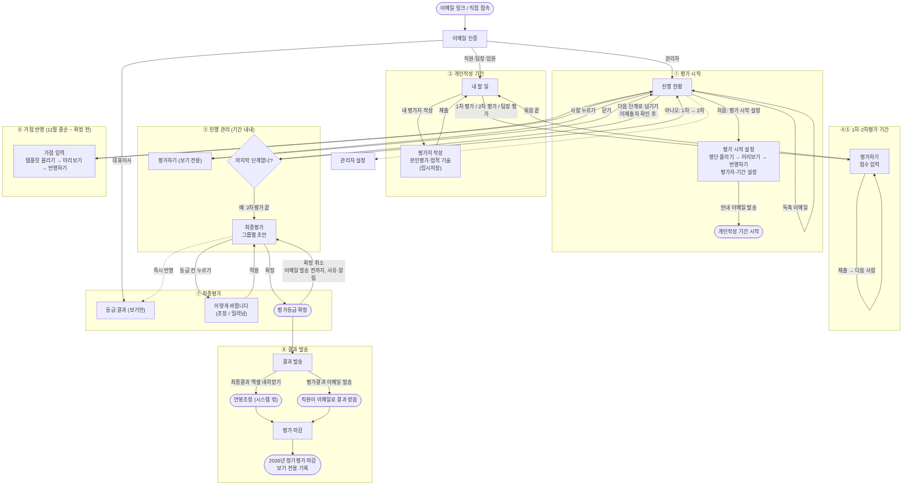

# 1. 사용자 흐름도 — 연 1회 정기평가

> 출처: UX 설계 워크숍 (2026-10-01). 기준 문서: `docs/domain/01-도메인-이야기.md` 1-7 바뀐 뒤의 모습
> 표기: 워크숍에서 정한 것은 그대로, 정하지 않고 설계자가 채운 것은 **(가정)**, 정하지 못한 것은 **(미정)**.

---

## 1-1. 누가, 언제 이 서비스를 여는가

| 누가 | 여는 순간 | 그때 머릿속 생각 | 들어오는 길 |
|---|---|---|---|
| **관리자** (파트장·경영지원실장) | 평가 시작, 평가 기간 중 거의 매일, 가점표를 받았을 때, 대표이사 보고 날, 결과 보낼 때 | "지금 누가 어디서 멈춰 있지?" | 직접 접속 → 이메일 인증 → **진행 현황** |
| **직원** (팀원·팀장 본인) | 안내·독촉 이메일의 링크를 눌렀을 때 | "뭘 써야 하고, 언제까지지?" | 이메일 링크 → 이메일 인증 → **내 할 일** |
| **팀장** (평가자) | 1차평가 기간 안내·독촉 이메일을 받았을 때 | "내가 평가할 사람이 몇 명 남았지?" | 이메일 링크 → 이메일 인증 → **내 할 일** |
| **임원** | 2차평가 기간 안내·독촉 이메일을 받았을 때 | "누구를 평가할 수 있고, 누구는 1차를 기다리는 중이지?" | 이메일 링크 → 이메일 인증 → **내 할 일** |
| **대표이사** | 파트장이 보고하는 자리 | "그룹별로 누가 어떤 등급이지?" | 이메일 링크 → 이메일 인증 → **등급 결과** |

- 인사평가는 극대외비이므로 **모든 사람이 이메일 인증**을 거친다.
- 팀장은 **피평가자이면서 평가자**다. 그래서 내 할 일에 두 종류의 할 일이 함께 보인다.
- 관리자를 뺀 모든 사람은 이메일 링크로만 들어온다.

---

## 1-2. 평가의 큰 단계

평가는 **기간**으로 움직이고, 단계를 넘기는 것은 **관리자**다.

```
평가 시작 설정 → [개인작성 기간] → 넘기기 → [1차평가 기간] → 넘기기 → [2차평가 기간] → 넘기기
→ 가점 반영(11월 중순~확정 전) → 최종평가(초안 → 등급조정 → 확정) → 결과 발송 → 평가 마감
```

- 기간 안에서는 그 단계의 작성자·평가자가 **자유롭게 쓰고 고친다.** 제출한 뒤에도 고칠 수 있다.
- 기간이 지나도 **저절로 잠기지 않는다.** 화면에 "기한 지남"으로 표시될 뿐이다.
- **관리자가 "다음 단계로 넘기기"를 누를 때** 앞 단계가 잠긴다. 미제출자가 있으면 명단을 보여 주고 "그래도 넘길까요?"를 확인한 뒤 넘긴다. 미제출자는 **빈칸인 채로 잠긴다.**
- 직원이 제출하면 1차 팀장과 2차 임원이 **바로 볼 수 있다.** 점수 입력은 각자의 평가 기간에만 할 수 있다.
- 임원은 1차평가 기간에는 **보기만** 하고, 2차평가 기간에 1차 점수를 보면서 입력한다.

---

## 1-3. 진입부터 완료까지 (글)

### ① 평가 시작 — 관리자
1. **이메일 인증** → **진행 현황**이 열린다. 처음에는 "아직 시작한 평가가 없습니다"와 **[평가 시작 설정]** 버튼만 있다.
2. **평가 시작 설정**에서 **직원 명단 템플릿**을 내려받아 채워 올린다.
3. 미리보기가 나온다. 6월 말 이후 입사자는 "제외", 빈칸이 있는 사람은 "확인 필요"로 표시된다. 확인 필요가 없어지면 **[반영하기]**를 누른다.
4. 대상자 표에서 그룹, 평가지 종류, 1차·2차 평가자를 확인한다. **부서이동자**는 평가 진행 시점 부서의 팀장·임원으로 고친다.
5. 개인작성 기간, 1차평가 기간, 2차평가 기간, 가점 인정 기준일을 넣는다.
6. **[안내 이메일 발송]**을 누른다. "발송 중 85 / 120"이 보이고, 화면을 떠나도 발송은 계속된다.
7. 이 시점부터 개인작성 기간이 시작된다.

### ② 개인작성 기간 — 직원·팀장
1. 이메일 링크 → **이메일 인증** → **내 할 일**. 맨 위에 "내 평가지 작성 — 마감 11/7"이 가장 크게 보인다.
2. 누르면 **평가지 작성**이 열린다. 팀원은 팀원용, 팀장은 팀장용 항목이 보인다.
3. 본인평가와 업적 기술을 쓴다. 쓰는 내용은 **저절로 임시저장**된다. 나갔다 들어와도 쓰던 자리 그대로다.
4. **[제출]** → 내 할 일로 돌아온다. "제출 완료 — 11/7까지 고칠 수 있습니다"가 보인다.
5. 기간 안에는 다시 열어 고칠 수 있다. 관리자가 넘기면 "제출 완료 (잠김)"으로 바뀐다.

### ③ 진행 관리 — 관리자 (기간 내내)
1. **진행 현황** 맨 위의 단계 줄에서 지금 단계와 남은 기간을 본다.
2. 미제출자 목록에서 **멈춘 사람**을 바로 찾는다.
3. 미제출자를 골라 **[독촉 이메일]**을 보낸다.
4. 기간이 끝나면 **[다음 단계로 넘기기]**를 누른다. 미제출자가 있으면 명단을 확인한 뒤 넘긴다.
5. 특정 평가지를 보고 싶으면 그 줄을 눌러 **평가하기**를 보기 전용으로 연다.

### ④ 1차평가 기간 — 팀장
1. 이메일 링크 → **이메일 인증** → **내 할 일**. "1차 평가 — 팀원 8명 중 5명 남음" 묶음이 보인다.
2. 누르면 **평가하기**가 열린다. 피평가자의 업적 기술을 보면서 역량 10개와 업적 1개를 1~10점으로 매긴다.
3. **[제출]** → **[다음 사람]**으로 다음 팀원으로 넘어간다.
4. 팀장은 **2차 임원의 평가를 볼 수 없다.**
5. 다 끝나면 내 할 일에 "1차 평가 8명 중 8명 완료"가 보이고, 그 묶음은 아래로 내려간다.

### ⑤ 2차평가 기간 — 임원
1. 이메일 링크 → **이메일 인증** → **내 할 일**. "2차 평가" 묶음과 "팀장 평가" 묶음이 보인다.
2. **평가하기**에서 **1차 점수를 함께 보면서** 2차 점수를 매긴다.
3. 1차평가 기간 중에 들어오면 같은 화면이 **보기만** 된다. 이때 "2차평가 기간에 입력할 수 있습니다"가 보인다.
4. **[제출]** → **[다음 사람]**.

### ⑥ 가점 반영 — 관리자 (11월 중순 ~ 확정 전)
1. **가점 입력**에서 **[템플릿 내려받기]**를 누른다. 템플릿에는 가점 항목별 칸이 있고, 다면평가 칸은 팀장에게만 있다.
2. 개별담당자 자료로 칸을 채우고 **[템플릿 올리기]**를 누른다.
3. 미리보기가 나온다. "120명 중 118명 일치, 이름이 맞지 않는 2명"처럼 보인다. **[반영하기]**를 누른다.
4. 맞지 않는 사람은 템플릿을 고쳐 다시 올리거나, 그 줄을 눌러 한 사람씩 입력한다.

### ⑦ 최종평가 → 등급조정 → 확정 — 관리자 / 대표이사
1. 2차평가 기간을 넘기면 **최종평가**에 그룹별 **초안**이 나온다. 점수 순서, S~D 초안 등급이 보이고, 반올림과 동점자 근속 규칙이 적용되어 있다.
2. 보고 자리에서 대표이사는 **등급 결과**를 보고, 파트장은 **최종평가**에서 조정한다.
3. 등급 칸을 눌러 새 등급을 고르면 **"이렇게 바뀝니다"** 미리보기가 나온다. 조정되는 사람과 밀려나는 사람이 함께 보인다.
   - 올리면 그 등급의 최하단이 한 칸 내려간다.
   - 내리면 그 등급의 최상단이 한 칸 올라간다.
4. **[적용]**을 누르면 대표이사 화면에도 **바로** 반영된다. 최종점수는 바뀌지 않는다.
5. 조정이 끝나면 **[확정]**을 누른다.
6. 잘못을 발견하면 평가결과 이메일을 보내기 전까지 **[확정 취소]**를 할 수 있다. 사유를 적고, 다른 관리자에게 알림이 간다.

### ⑧ 결과 발송 → 평가 마감 — 관리자
1. **결과 발송**에서 **[최종결과 엑셀 내려받기]**를 눌러 연봉조정에 쓴다.
2. 연봉계약 면담 시점에 **[평가결과 이메일 발송]**을 누른다. 이메일에는 1차 점수, 2차 점수, 가점, 최종점수, 평가등급, 상위 %가 들어간다. 발송 진행 숫자가 보이고, 실패한 사람은 **[다시 보내기]**를 누른다.
3. 연봉조정까지 끝난 것을 확인하면 **[평가 마감]**을 누른다.
4. 진행 현황에 **"2026년 정기평가 마감 (12/15, 마감자 ○○○)"**이 뜨고, 그해 평가는 보기 전용 기록이 된다. **← 끝났다는 신호**

---

## 1-4. 이동 규칙

| 상황 | 규칙 |
|---|---|
| 작성·평가 중에 뒤로 가거나 창을 닫음 | 임시저장되어 있으므로 잃는 것 없음. 내 할 일에 "작성 중"으로 표시 |
| 제출 후 | 내 할 일로 돌아감. 기간 안이면 다시 열어 고칠 수 있음 |
| 평가하기에서 한 사람을 끝냄 | [다음 사람]으로 같은 묶음의 다음 피평가자로 이동 |
| 한동안 쓰지 않아 인증이 끊김 | 이메일 인증으로 갔다가, 인증하면 **하던 화면으로 돌아옴** (가정) |
| 관리자 화면 사이 이동 | 관리자 화면 위쪽에 늘 **관리자 메뉴**가 있음: 진행 현황 · 평가 시작 설정 · 가점 입력 · 최종평가 · 결과 발송 · 관리자 설정 (가정) |
| 관리자가 특정 평가지를 봄 | 진행 현황 등의 목록에서 사람을 누르면 평가하기가 **보기 전용**으로 열림. 닫으면 원래 목록으로 돌아감 |
| 관리자 본인이 평가 대상·평가자인 경우 | 관리자 메뉴 옆에 **내 할 일**로 가는 길이 있음 (가정) |
| 대표이사 | 등급 결과 한 화면만 씀. 다른 화면으로 가는 길 없음 |

---

## 1-5. 순서도 (Mermaid)


